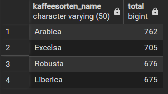

# SQL Portfolio

## Beschreibung
Dieses Projekt enthält SQL-Übungen und Projekte mit:
## Tools
- SQL Server
- PostgreSQL

## Projektstruktur
- /sql-server → T-SQL Übungen und AdventureWorks
- /postgresql → Datenmigration und Systemvergleich
- /github-research → Analyse von GitHub-Profilen und Projekten

## Ziel dieses Projekts

Dieses Projekt zeigt meine Fähigkeit:
- SQL-Abfragen zu schreiben
- Daten zu analysieren
- Businessfragen zu beantworten
  
## Beispiele

### Beispiel 1: Anzahl der Bestellungen

### Wie viele Transaktionen/Käufe sind insgesamt im Datensatz enthalten?
```sql
SELECT COUNT(*)
FROM   bestellung;
```
- Ergebnis: Gesamtanzahl aller Bestellungen :758
SQL-Datei:
[count_orders.sql](sql-server/count_orders.sql)

### Beschreibung:
Diese Abfrage zählt die Gesamtanzahl der Bestellungen in der Tabelle.

### Beispiel 2: Meistverkaufte Kaffeesorten

Frage:  
Welche Kaffeesorten werden am häufigsten verkauft?
### Ergebnis:  Arabica ist die meistverkaufte Kaffeesorte (762 Verkäufe)
### Ergebnis (Screenshot)



### Erklärung

- JOIN verbindet mehrere Tabellen (Bestellungen, Produkte, Kaffeesorten)
- SUM(bd.Menge) berechnet die gesamte Verkaufsmenge
- GROUP BY gruppiert nach Kaffeesorten
- ORDER BY DESC zeigt die meistverkauften zuerst

### Business Insight

- Arabica ist die meistverkaufte Kaffeesorte
- Das Unternehmen sollte:
  - mehr Arabica lagern
  - Marketing auf Arabica fokussieren
    
SQL-Datei:
[kaffeesorten.sql](sql-server/kaffeesorten.sql)

#### Beispiel 3: Durchschnittlicher Bestellwert

## Frage:
-- Wie hoch ist der durchschnittliche Bestellwert?

```sql
WITH bestellung_summe AS (
    SELECT 
        bestellung_id,
        SUM(verkaeufe) AS gesamtbetrag
    FROM bestellung_details
    GROUP BY bestellung_id
)
SELECT 
    ROUND(AVG(gesamtbetrag),2) AS durchschnittlicher_bestellwert
FROM bestellung_summe;
```
## Ergebnis:
Der durchschnittliche Bestellwert beträgt etwa 44.

## Beschreibung:
Die Berechnung erfolgt in zwei Schritten:
Zuerst wird der Gesamtbetrag pro Bestellung berechnet,
anschließend wird der Durchschnitt über alle Bestellungen ermittelt.

## Business Insight:
Das Unternehmen kann diesen Wert nutzen,
um Preisstrategien oder Mindestbestellwerte zu optimieren.


##### Coffee Sales Analyse Projekt

## Beschreibung:
Analyse von Verkaufsdaten eines Kaffeeunternehmens.

## Inhalt:
- Datenaufbereitung
- SQL-Abfragen
- Analyse der meistverkauften Produkte


PDF:
[coffee_sales_analysis.pdf](projects/coffee_sales_analysis.pdf)

